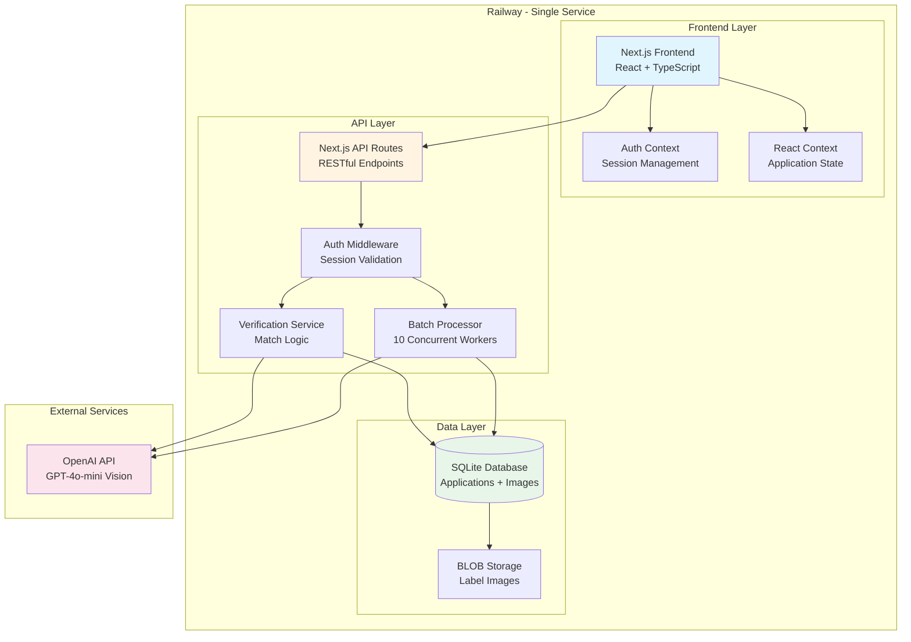
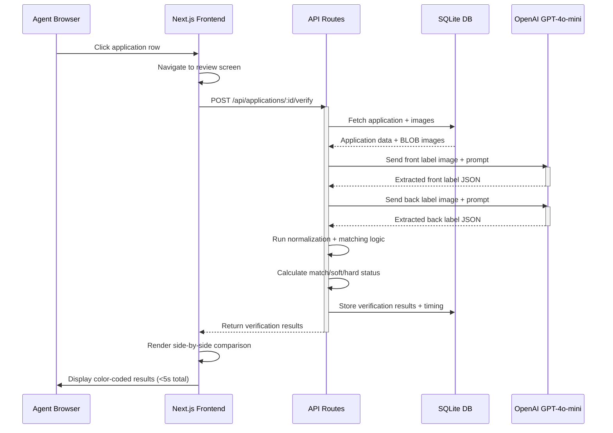
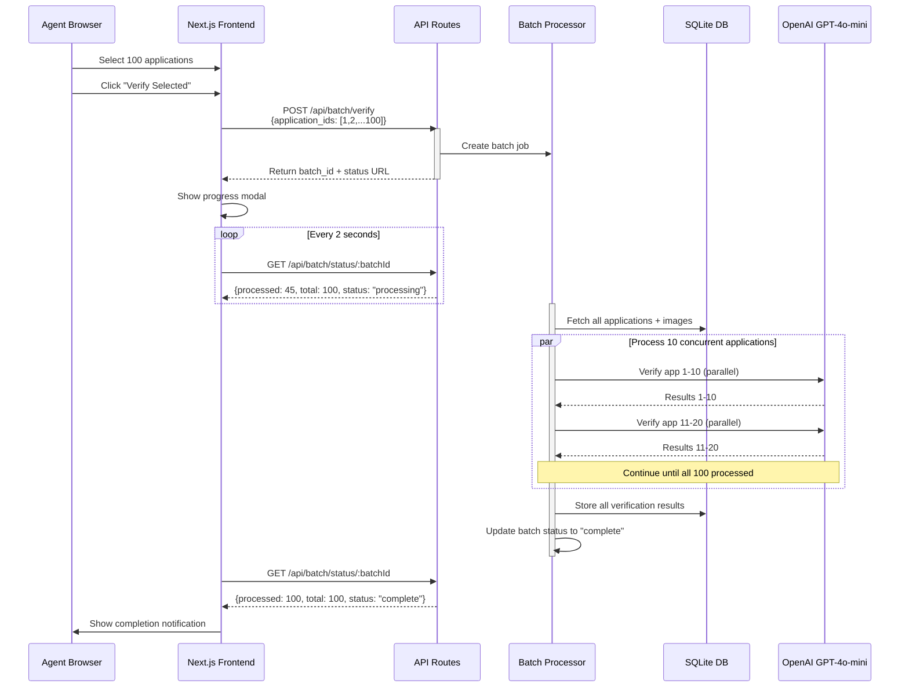
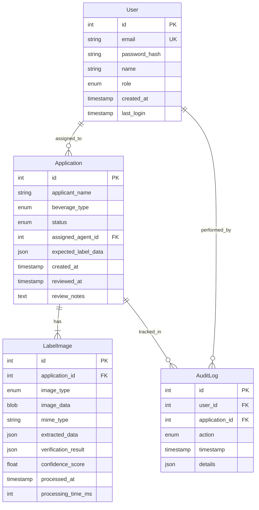
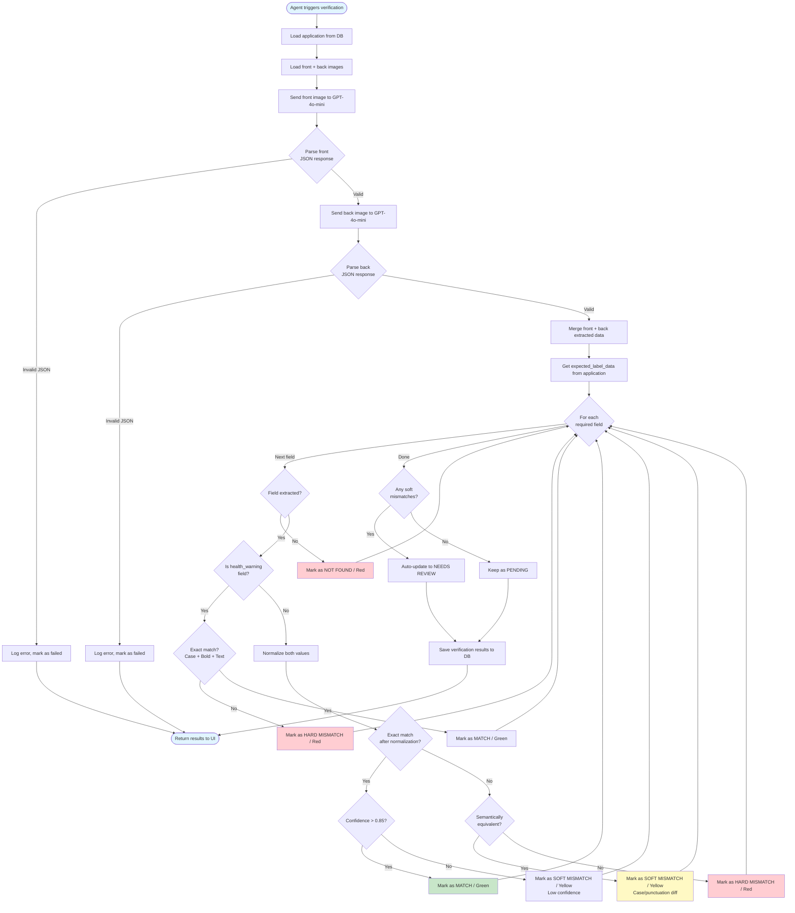
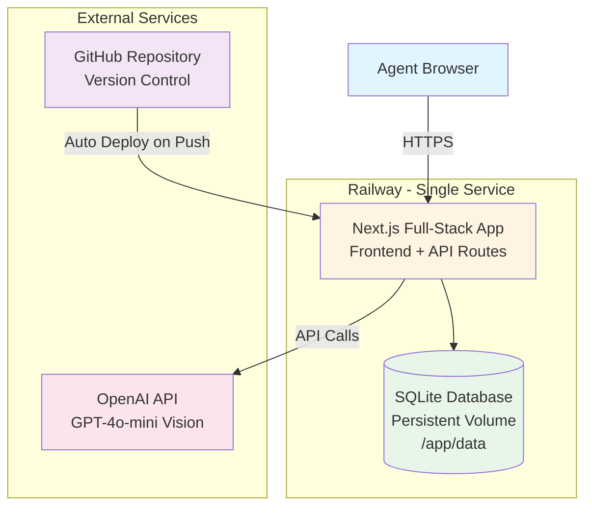
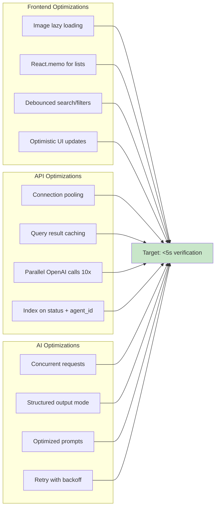
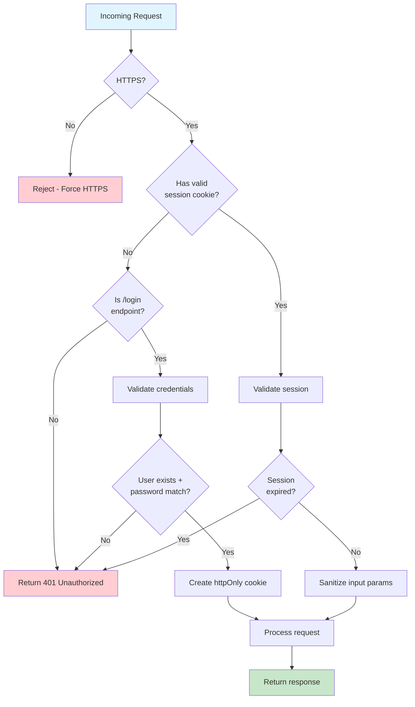
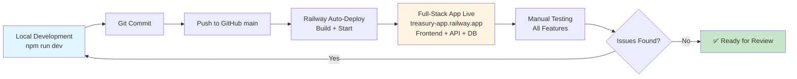

# TTB Label Verification System - Architecture

## System Architecture Overview



## Data Flow - Single Application Verification



## Data Flow - Batch Processing



## Component Architecture

```mermaid
graph LR
    subgraph "Frontend Components"
        Login[LoginPage]
        Dashboard[Dashboard<br/>Application Queue]
        Review[ReviewPage<br/>Side-by-Side View]
        ImageViewer[ImageViewer<br/>Zoom/Pan]
        ComparisonTable[ComparisonTable<br/>Color-Coded Fields]
        BatchModal[BatchProgressModal]
    end

    subgraph "Context Providers"
        AuthContext[AuthContext<br/>User Session]
        AppContext[ApplicationContext<br/>Selected Apps]
    end

    subgraph "API Routes"
        AuthAPI[/api/auth/*]
        AppAPI[/api/applications/*]
        BatchAPI[/api/batch/*]
    end

    subgraph "Services"
        AuthService[AuthService<br/>Session + bcrypt]
        VerificationService[VerificationService<br/>AI + Matching]
        NormalizationService[NormalizationService<br/>Text Normalization]
        ImageService[ImageService<br/>BLOB Management]
    end

    Login --> AuthContext
    Dashboard --> AuthContext
    Dashboard --> AppContext
    Review --> AppContext
    Review --> ImageViewer
    Review --> ComparisonTable
    Dashboard --> BatchModal

    AuthAPI --> AuthService
    AppAPI --> VerificationService
    BatchAPI --> VerificationService
    VerificationService --> NormalizationService
    VerificationService --> ImageService

    style Login fill:#e1f5ff
    style Dashboard fill:#e1f5ff
    style Review fill:#e1f5ff
    style AuthContext fill:#fff4e1
    style VerificationService fill:#e8f5e9
```

## Database Schema



## Verification Logic Flow



## Deployment Architecture



## Technology Stack Summary

| Layer                | Technology                | Purpose                                 |
| -------------------- | ------------------------- | --------------------------------------- |
| **Framework**        | Next.js 14+ (App Router)  | Full-stack React framework with SSR/SSG |
| **UI Components**    | Tailwind CSS + shadcn/ui  | Styling + pre-built components          |
| **State Management** | React Context             | Authentication + application state      |
| **API Layer**        | Next.js API Routes        | RESTful API endpoints (same codebase)   |
| **Database**         | SQLite (better-sqlite3)   | Persistent storage with BLOB support    |
| **AI Integration**   | OpenAI Node SDK           | GPT-4o-mini vision model                |
| **Authentication**   | bcrypt + httpOnly cookies | Session-based auth                      |
| **Image Handling**   | sharp (optional)          | Image processing/optimization if needed |
| **Deployment**       | Railway (single service)  | Full-stack hosting + persistent volume  |
| **Version Control**  | Git + GitHub              | Source control + auto-deploy            |
| **Runtime**          | Node.js 20+               | JavaScript runtime                      |

## Performance Optimization Strategy



## Security Architecture



---

## Railway Deployment Configuration

### Environment Setup

**Environment Variables (Railway):**

```bash
# OpenAI API
OPENAI_API_KEY=sk-proj-...

# Database
DATABASE_URL=file:/app/data/treasury.db

# Authentication
JWT_SECRET=your-secure-random-secret-here
SESSION_SECRET=your-secure-session-secret-here

# Node Environment
NODE_ENV=production
```

### Railway Service Configuration

**Build Settings:**

```json
{
  "builder": "NIXPACKS",
  "buildCommand": "npm install && npm run build",
  "startCommand": "npm start"
}
```

**Persistent Volume:**

- Mount Path: `/app/data`
- Purpose: SQLite database file storage
- Size: 10GB (sufficient for 150K apps/year with images)

**Health Check:**

- Endpoint: `/api/health`
- Interval: 30 seconds
- Timeout: 10 seconds

### Deployment Process

1. **Push to GitHub:** Commit and push to `main` branch
2. **Auto-Deploy Trigger:** Railway detects push via webhook
3. **Build Phase:** `npm install && npm run build`
4. **Start Phase:** `npm start` (Next.js production server)
5. **Health Check:** Railway verifies `/api/health` endpoint
6. **Live:** Application available at `treasury-app.railway.app`

### Local Development

```bash
# Install dependencies
npm install

# Set up environment
cp .env.example .env
# Edit .env with OPENAI_API_KEY

# Initialize database (run seed script)
npm run db:seed

# Start development server
npm run dev

# Open browser
http://localhost:3000
```

---

## Key Architecture Decisions

### 1. **Single Railway Service** (vs. Vercel + Railway split)

- **Rationale:** Simpler deployment, no CORS issues, single environment, faster development
- **Trade-off:** No edge CDN (acceptable - app is internal, not public-facing)
- **Why not Vercel:** Adds complexity, two billing accounts, network latency between services

### 2. **Monolithic Next.js App** (vs. separate frontend/backend)

- **Rationale:** Shared TypeScript types, simpler deployment, faster development
- **Trade-off:** Less flexibility for independent scaling (acceptable for prototype)

### 3. **SQLite with BLOBs** (vs. PostgreSQL + S3)

- **Rationale:** Simple deployment, single backup file, no external storage, perfect for 150K apps/year
- **Trade-off:** Limited concurrent writes (acceptable for mostly-read workload)

### 4. **Synchronous Batch Processing** (vs. async queue with Redis)

- **Rationale:** Simpler implementation, real-time progress updates, no additional infrastructure
- **Trade-off:** API server blocks during batch (acceptable for 100 concurrent users)

### 5. **10 Concurrent OpenAI Calls** (vs. 1 or unlimited)

- **Rationale:** Balances speed with rate limits and cost (100 apps in ~20 seconds)
- **Trade-off:** Not unlimited parallelism (acceptable - meets <3min target)

### 6. **React Context** (vs. Redux/Zustand)

- **Rationale:** Sufficient for auth + selection state, no complex global store needed
- **Trade-off:** Less structured state management (acceptable for prototype scope)

### 7. **Session Cookies** (vs. JWT)

- **Rationale:** Simpler server-side revocation, no token refresh logic, more secure
- **Trade-off:** Less suitable for multi-server deployments (not needed - single Railway service)

---

## Scalability Considerations

| Bottleneck               | Current Solution         | Production Migration Path          |
| ------------------------ | ------------------------ | ---------------------------------- |
| SQLite concurrent writes | Single Railway instance  | → PostgreSQL on Railway/RDS        |
| BLOB storage             | SQLite BLOB column       | → S3/Cloudflare R2 + DB references |
| Batch processing         | Synchronous 10x parallel | → Bull queue + Redis + workers     |
| Session storage          | SQLite sessions table    | → Redis session store              |
| API rate limits          | None (prototype)         | → Express rate-limit middleware    |

---

## Development Workflow


